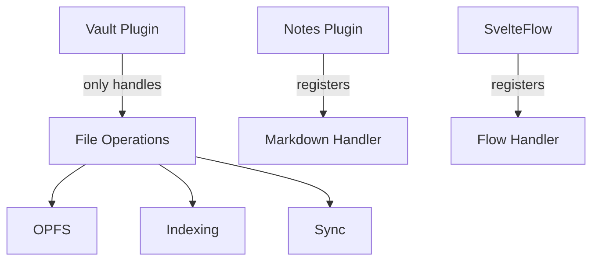

# Revised Plugin Architecture

## Plugin Types

1. **File Plugins** (Vault, Notes, SvelteFlow):

   - Handle file storage/retrieval
   - Register file handlers
   - Example: Vault (OPFS), Notes (Markdown)

2. **View Plugins** (Editor, Renderer):

   - Provide UI components
   - Register view handlers
   - Example: MarkdownEditor, SvelteFlowView

3. **Utility Plugins**:
   - Provide non-UI functionality
   - Example: AI, Search

## Vault Plugin Scope



## Editor Management Proposal

1. **Core Provides**:

   - Editor container component
   - View registry system
   - Context management

2. **Plugins Register**:

```typescript
// In plugin initialization
registerView({
	type: 'note',
	component: MarkdownEditor,
	icon: '📝',
	priority: 0
});
```

## State Structure Changes

```typescript
// In state.svelte.ts
export const app = $state({
	// ... existing ...
	fileHandlers: {} as Record<string, FileHandler>,
	viewHandlers: {} as Record<string, ViewHandler>
});

interface ViewHandler {
	component: ConstructorOfATypedSvelteComponent;
	icon?: string;
	priority: number;
}
```

## Example Plugin Initialization

```typescript
// notes-plugin.ts
registerPlugin({
	id: 'notes',
	init: () => {
		// File handling
		registerFileType('note', markdownHandler);

		// View handling
		registerView({
			type: 'note',
			component: MarkdownEditor,
			icon: '📝'
		});
	}
});
```

## Key Benefits

1. Clear separation between:
   - File management (Vault)
   - Content handling (Plugins)
   - View rendering (Editor plugins)
2. Flexible extension points
3. Better single responsibility
